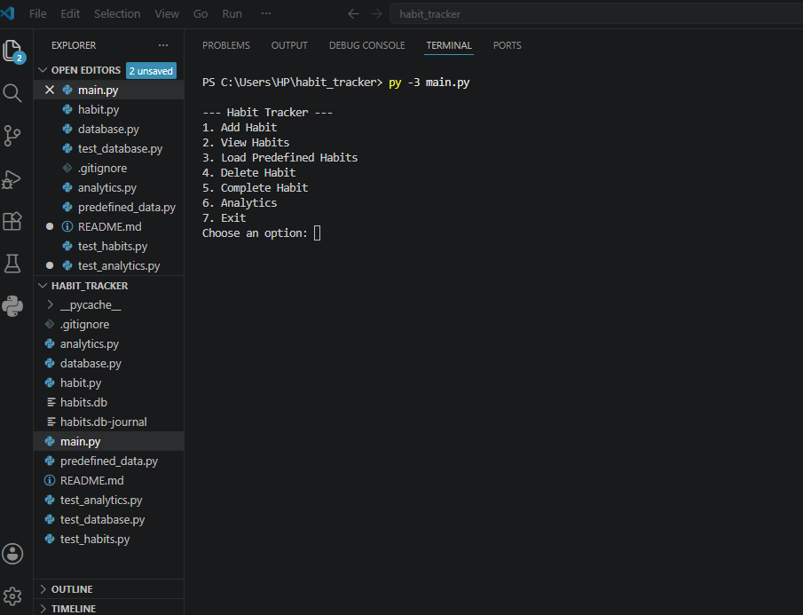
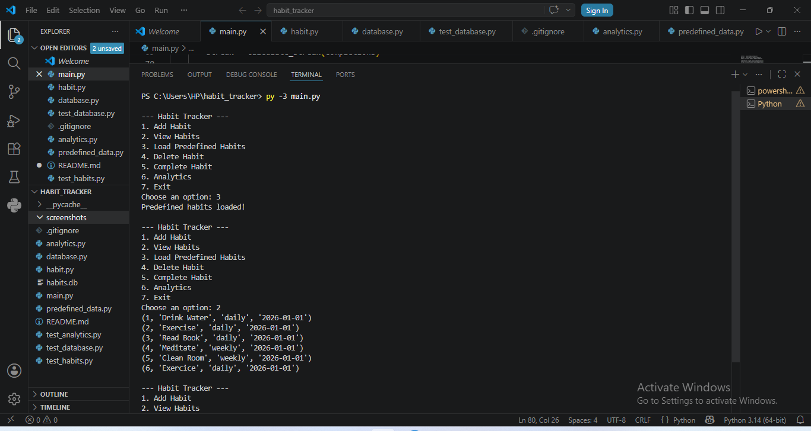
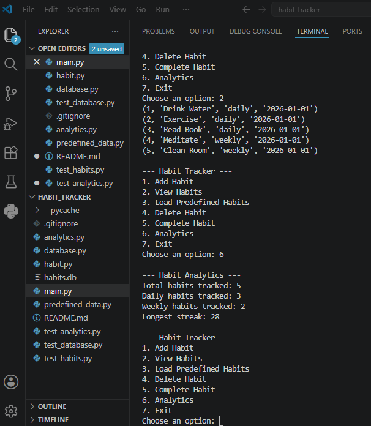
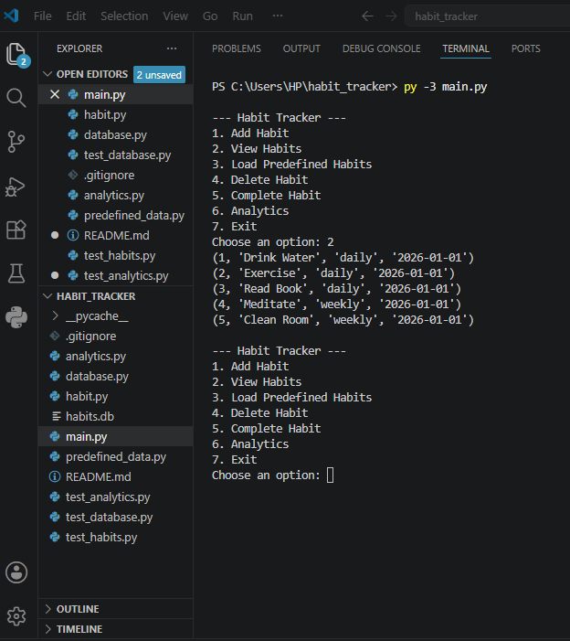
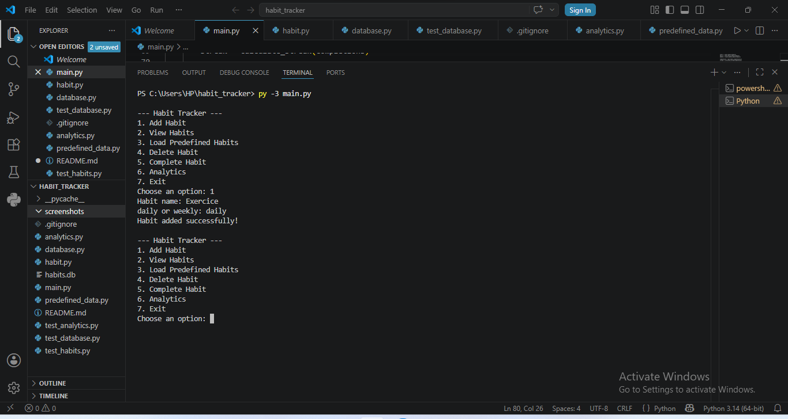
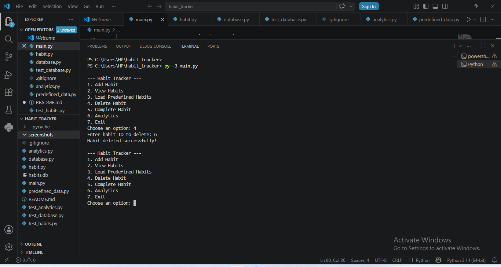
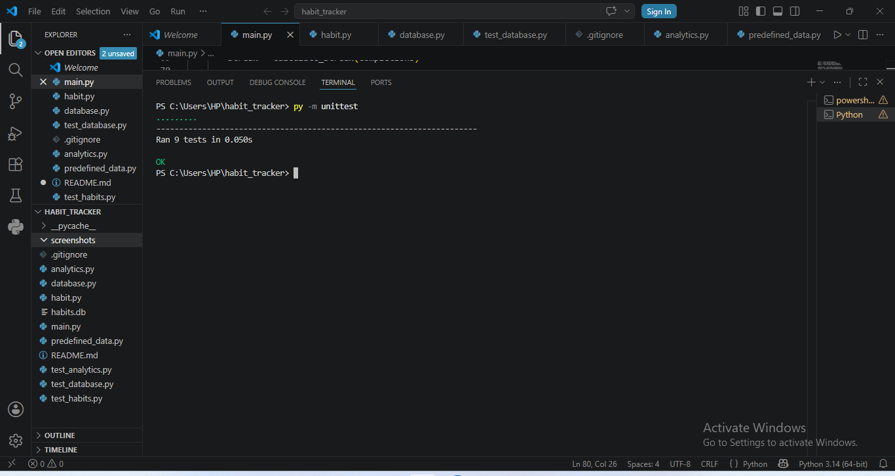

# Habit Tracker Application
## Table of Contents

- [Overview](#overview)
- [Features](#features)
  - [Habit Management](#habit-management)
  - [Analytics](#analytics)
  - [Data Storage](#data-storage)
  - [Testing](#testing)
- [Technologies Used](#technologies-used)
- [Installation](#installation)
- [Usage](#usage)
- [Analytics Functions](#analytics-functions)
- [Project Structure](#project-structure)
- [Unit Testing](#unit-testing)
- [Screenshots](#screenshots)
- [Object-Oriented Design](#object-oriented-design)
- [Future Improvements](#future-improvements)


## Overview

The Habit Tracker Application is a Python-based command-line application developed as part of the Object-Oriented and Functional Programming Portfolio Project.
The application allows users to create, manage, complete, and analyse habits. Habit information is stored in a SQLite database, enabling persistent data storage between program executions.
The project demonstrates Object-Oriented Programming (OOP), database management, modular software design, unit testing, and analytics functionality.

## Features

### Habit Management
- Add new habits
- View all habits
- Delete habits
- Complete habits
- Load predefined habits
### Analytics
- Count all habits
- Count daily habits
- Count weekly habits
- Filter habits by periodicity
### Data Storage
- SQLite database integration
- Persistent storage of habits
- Persistent storage of completion records
### Testing
- Unit testing using Python's unittest module
- Unit tests for database operations
- Unit tests for streak calculations
- Unit tests for analytics functions

## Technologies Used
- Python 3
- SQLite3
- Object-Oriented Programming (OOP)
- Functional Programming (FP)
- unittest

## Installation

1. Clone the repository:

```bash
git clone https://github.com/cybalist247/habit_tracker.git
```

2. Navigate to the project folder:

```bash
cd habit-tracker
```

3. Run the application:

```bash
py main.py
```

## Usage

When the application starts, the following menu is displayed:

```text
--- Habit Tracker ---

1. Add Habit
2. View Habits
3. Load Predefined Habits
4. Delete Habit
5. Complete Habit
6. Analytics
7. Exit
```

### Add Habit

Allows users to create a new habit by entering:

- Habit Name
- Periodicity (Daily or Weekly)

### View Habits

Displays all habits currently stored in the database.

### Delete Habit

Removes a selected habit from the database.

### Complete Habit

Marks a habit as completed and stores the completion date.

### Analytics

Provides information about stored habits including:

- Total number of habits
- Number of daily habits
- Number of weekly habits
- Habits filtered by periodicity

## Analytics Functions

The analytics module currently provides:

### Count All Habits

Returns the total number of habits stored.

### Count Daily Habits

Returns the total number of daily habits.

### Count Weekly Habits

Returns the total number of weekly habits.

### Habits by Periodicity

Returns habits matching a selected periodicity.

### Example of Analytics

--- Habit Analytics ---
Total habits tracked: 5
Daily habits tracked: 3
Weekly habits tracked: 2
Longest streak: 28


---

## Project Structure

```text
habit_tracker/
│
├── main.py
├── habit.py
├── database.py
├── analytics.py
├── predefined_data.py
│
├── test_habit.py
├── test_database.py
├── test_analytics.py
│
├── README.md
├── .gitignore
│
└── screenshots/
    ├── main_menu.png
    ├── view_habits.png
    ├── analytics.png
    └── tests.png
```

---

## Unit Testing

The project includes automated unit tests using Python's unittest framework.

Run tests using:

```bash
py -m unittest
```

Example output:

```text
..
----------------------------------------------------------------------
Ran 9 tests in 0.001s

OK
```

---

## Screenshots

### Main Menu



### Predefined Habits



### Analytics Results



### Habit List



### Add Habit



### Delete Habit



### Unit Test Results



---

## Object-Oriented Design

The application follows Object-Oriented Programming principles through:

- Habit class
- Habit Tracker management system
- SQLite database layer
- Analytics module

This modular structure improves maintainability, scalability, and code readability.

## Future Improvements

Possible future enhancements include:

- Graphical User Interface (GUI)
- Advanced streak calculations
- Reminder notifications
- Cloud synchronization
- Mobile application support

